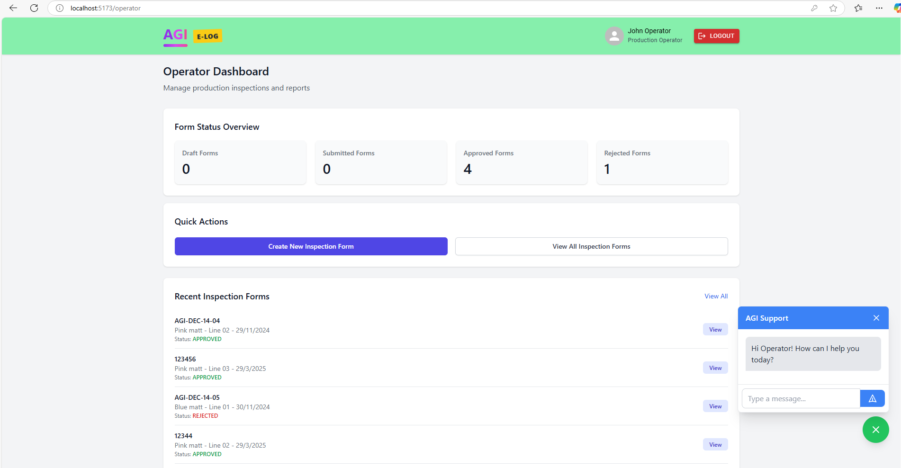

# AGI E-Log - Quality Assurance Inspection System

## Overview

AGI E-Log is a web-based inspection management system developed for AGI Greenpac Limited's Speciality Glass Division. The application streamlines the creation, submission, review, and approval of inspection forms used in quality assurance processes for glass coatings.


## Purpose

This system digitizes the "First Article Inspection Report - Coating" process, replacing paper-based workflows with a more efficient and trackable electronic system. It allows different stakeholders in the quality assurance process to:

- Create and submit inspection forms
- Review submitted forms
- Approve or reject forms with comments
- Track inspection history and metrics
- Generate reports on quality assurance activities

## Key Features

- **Role-based access control**: Different interfaces and permissions for Operators, QA personnel, AVPs, and Administrators
- **Digital form creation and submission**: Standardized format for inspection data
- **Real-time status tracking**: Monitor forms through their entire lifecycle
- **Centralized data storage**: Easy retrieval of historical records
- **Dashboard views**: Role-specific metrics and pending actions 
- **Support chatbot**: Built-in assistant for common queries
- **Digital signatures**: Electronic sign-off by relevant personnel

## Application Screenshots

### Login Page

*The login interface where users authenticate with their credentials and select their role*

### Operator Dashboard

*Dashboard for Production Operators showing form status overview and quick actions*

### Operator View - Create Forms

*Interface for operators to create new inspection forms*

### Operator View - Forms List

*List view of forms submitted by the operator*

### QA Dashboard

*Dashboard for QA personnel showing pending reviews and quality metrics*

### QA Review Forms

*Interface for QA to review and process submitted forms*

### AVP Dashboard

*Dashboard for AVP users with approval metrics and pending items*

### AVP Review Interface

*Interface for AVPs to review and approve/reject forms*

### Quality Assurance Add Products

*Interface for QA to add and manage product specifications*

## System Architecture

### Frontend 
- React.js for user interface
- React Router for navigation
- Tailwind CSS for styling
- Context API for state management

### Backend (implied)
- RESTful API for data operations
- Authentication services
- Form processing and storage

## User Roles

1. **Production Operator**
   - Create new inspection forms
   - Submit forms for approval
   - View status of submitted forms

2. **Quality Assurance (QA)**
   - Review submitted forms
   - Add quality observations and measurements
   - Forward forms to AVP for approval

3. **AVP (Assistant Vice President - QA & Systems)**
   - Review and approve/reject inspection forms
   - Monitor quality metrics and compliance
   - Oversee the QA process

4. **Master Admin**
   - Full system access
   - View all forms regardless of status
   - Access system-wide metrics and reports

## Core Workflows

### Inspection Form Lifecycle
1. **Creation**: Operator fills basic form information (product details, lacquer information)
2. **Submission**: Operator submits form for QA review
3. **QA Review**: QA personnel adds observations and measurements 
4. **Final Approval**: AVP reviews and either approves or rejects the form
5. **Record Keeping**: Approved forms are stored for future reference

### Dashboard Views
Each role has a customized dashboard showing:
- Pending actions
- Recent activity
- Relevant metrics
- Quick access to common functions

## Directory Structure

```
/src
  /assets
    - QASign.png
    - OperatorSign.png
  /components
    - App.js                   # Main application component
    - LoginForm.js             # Authentication interface
    - AuthContext.js           # Authentication state management
    - OperatorDashboard.js     # Operator interface
    - QADashboard.js           # QA personnel interface
    - AVPDashboard.js          # AVP/Manager interface
    - MasterDashboard.js       # Admin interface
    - InspectionFormList.js    # List view of forms
    - EditableInspectionForm.js # Form editor component
    - SharedComponents.js      # Reusable UI components
    - Chatbot.js               # Support assistant
    - api.js                   # API service module
```

## API Services

The application interacts with a backend service through the following API modules:

### Authentication API
- User login and validation

### Inspection Forms API
- Create, read, update forms
- Submit forms for review
- Approve/reject forms
- Query forms by status, ID, or submitter

### User Management API
- Retrieve user information
- Filter users by role

## Installation and Setup

### Prerequisites
- Node.js (v14+)
- npm or yarn
- Backend API service running (details to be provided separately)

### Installation Steps

1. Clone the repository
```bash
git clone https://github.com/swajyot-technologies/agi-elog.git
cd agi-elog
```

2. Install dependencies
```bash
npm install
```

3. Configure environment
Create a `.env` file in the root directory with the following:
```
REACT_APP_API_BASE_URL=http://your-api-server:port/api
```

4. Start development server
```bash
npm start
```

## Development Guidelines

### Coding Standards
- Use functional components with hooks
- Follow the container/presentational component pattern
- Keep components focused on a single responsibility
- Use consistent naming conventions

### State Management
- Use Context API for application-wide state (authentication)
- Use local component state for UI-specific state
- Leverage props for component communication

### Styling
- Use Tailwind CSS utility classes
- Maintain consistent color scheme and spacing
- Follow responsive design principles

## Testing

### Running Tests
```bash
npm test
```

### Test Coverage
```bash
npm run test:coverage
```

## Deployment

### Build for Production
```bash
npm run build
```

The production-ready files will be generated in the `build` directory.

### Deployment Options
- Deploy to web server or CDN
- Configure for continuous integration/deployment
- Ensure backend API is accessible from deployed location

## Support and Maintenance

### Common Issues
- Login problems: Check network connectivity and credentials
- Form submission errors: Verify required fields and API availability
- Display issues: Test on different browsers and screen sizes

### Contact Information
For support, contact Swajyot Technologies:
- Email: nandininc@swajyot.com
- Phone: +91-81972-20145

## License
Built by Swajyot Technologies. © 2002 – 2025.

---

## Technical Documentation

### Component Architecture

#### Authentication Flow
```
App
└── AuthProvider
    ├── LoginForm
    └── AuthRouter
        ├── OperatorDashboard
        ├── QADashboard
        ├── AVPDashboard
        ├── MasterDashboard
        └── InspectionFormLayout
            └── EditableInspectionForm
```

#### Form Management Flow
```
InspectionFormList
└── InspectionForm
    ├── FormHeader
    ├── InspectionDetails
    ├── LacquerTable
    ├── CharacteristicsTable
    └── ApprovalSection
```

### Key Libraries and Dependencies

- **react-router-dom**: Navigation and routing
- **axios**: API communication
- **tailwindcss**: Utility-first CSS framework
- **@mui/material & @mui/icons-material**: UI components and icons

### Data Models

#### User
```typescript
interface User {
  id: string;
  name: string;
  role: 'operator' | 'qa' | 'avp' | 'master';
  field?: string;
}
```

#### Inspection Form
```typescript
interface InspectionForm {
  id?: string;
  documentNo: string;
  issuanceNo: string;
  issueDate: string;
  reviewedDate: string;
  page: string;
  preparedBy: string;
  approvedBy: string;
  issued: string;
  inspectionDate: string;
  product: string;
  sizeNo: string;
  shift: string;
  variant: string;
  lineNo: string;
  customer: string;
  sampleSize: string;
  lacquers: Array<{
    id: number;
    name: string;
    weight: string;
    batchNo: string;
    expiryDate: string;
  }>;
  characteristics: Array<{
    id: number;
    name: string;
    observation?: string;
    bodyThickness?: string;
    bottomThickness?: string;
    comments: string;
  }>;
  qaExecutive: string;
  qaSignature: string | null;
  productionOperator: string;
  operatorSignature: string | null;
  finalApprovalTime: string;
  status: 'DRAFT' | 'SUBMITTED' | 'APPROVED' | 'REJECTED';
  submittedBy: string;
  submittedAt: string | null;
  reviewedBy: string;
  reviewedAt: string | null;
  comments: string;
}
```

### API Endpoints

#### Authentication
- `POST /api/users/login`: Authenticate user

#### Inspection Forms
- `GET /api/inspection-forms`: Get all forms
- `GET /api/inspection-forms/{id}`: Get form by ID
- `GET /api/inspection-forms/status/{status}`: Get forms by status
- `GET /api/inspection-forms/submitter/{submitter}`: Get forms by submitter
- `POST /api/inspection-forms`: Create new form
- `PUT /api/inspection-forms/{id}`: Update form
- `POST /api/inspection-forms/{id}/submit`: Submit form for approval
- `POST /api/inspection-forms/{id}/approve`: Approve form
- `POST /api/inspection-forms/{id}/reject`: Reject form

#### Users
- `GET /api/users`: Get all users
- `GET /api/users/role/{role}`: Get users by role

## Future Enhancements

### Planned Features
- Mobile-responsive design optimization
- Email notifications for form status changes
- Advanced reporting and analytics
- Integration with production systems
- Offline mode capabilities

### Technical Improvements
- Add comprehensive unit and integration tests
- Implement performance optimizations
- Enhance security measures
- Add multilingual support
- Improve accessibility compliance

---

*This documentation is confidential and proprietary to AGI Greenpac Limited and Swajyot Technologies.*